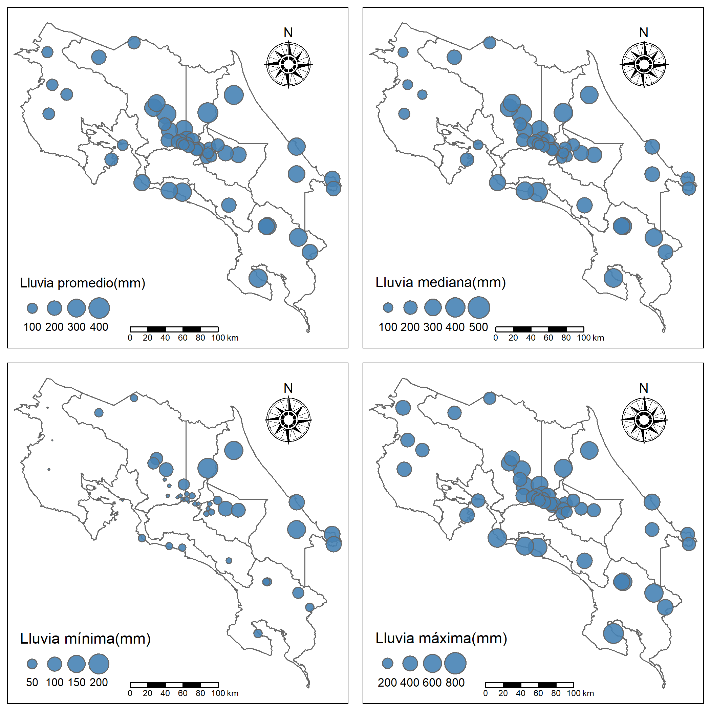

```{r setup, include=FALSE}
knitr::opts_chunk$set(echo = TRUE)
```

keywords{Geoestadística, precipitación, Kriging}

## Introducción

Costa Rica se ubica en una región con características tropicales con un entorno ecológico que comprende bosques, ríos, suelos y climas. Estos interactúan con condiciones de tropicales que son afectados por el relieve, la orientación noreste-sureste del sistema montañoso separa a Costa Rica en dos vertientes, Pacífica y Caribe, el primer régimen Pacífico presentan una época seca y lluviosa bien definida, mientras que el régimen Caribe no muestra una estación seca definida y con una importante precipitación lluviosa en todos los meses. La división de los regímenes explica las distribución de la lluvia en el país [@manso_2005].

En Instituto Meteorológico Nacional (IMN) de Costa Rica, ente científico que tiene a cargo la coordinación de todas las actividades meteorológicas y climatológicas, divide en 6 regiones el análisis del clima en el territorio nacional [@IMN_08], Valle Central, Pacífico Norte, Pacífico Central Pacífico Sur, Vertiente del Caribe y Zona Norte.

La región pacífico norte se ubica al noreste del país, zona llana, la influencia de los vientos y el relieve determinan la distribución mensual de la precipitación, anualmente presenta dos distribuciones marcadas, con precipitaciones muy bajas entre Noviembre y Abril, contrario, precipitaciones altas los demás meses.

La región pacífico central cuenta con un potencial hídrico importante influenciado por el mar, la precipitación es mayor en los valles, cuenta con relieves variados y la precipitación es diferente en cada relieve, entre más al sur mayor precipitación. La presencia de inundaciones es común.

El pacífico sur, con un componente hídrico importante producto del predominante relieve montañoso, es la zona más lluviosa del país, el periodo seco es muy corto.

La región central, ubicada en la región tectovolcánica que encierra principalmente la zona urbana del gran área metropolitana de nuestro país, definido por dos valles (Occidental y Oriental), se puede encontrar un clima seco por influencia del pacífico y un clima templado en las zonas montañosas con lluvia y frío.

La región norte, cuenta con llanura de fácil inundación por influencia del Caribe un bosque tropical húmedo, no cuenta con grandes ríos de agua, la precipitación es lluviosa todo el año, la tercera región más lluviosa.

La región del Caribe, es una región muy húmeda con un fuente hídrico importante, cuenta con dos subregiones (Caribe Norte, Caribe Sur), en esta región se presentan cambios extremos en la precipitaciones por eventos extremos de clima

Los datos se obtienen del departamento de información (IMN), con información de 48 estaciones georeferenciadas por coordenadas geográficas, cada estación es un centro de medición controlado por el IMN, además están distribuidos estratégicamente en las 6 regiones de Costa Rica, en muchos casos la información cuenta las variables de precipitación, temperatura, humedad, viento, altitud y radiación, sin embargo, las únicas variables comparables y siempre presentes en los archivos son la precipitación mm y la altitud m.s.n.m.

Generalmente, la presentación de la información sobre las condiciones climáticas contiene análisis geográfico representado por mapas con descripciones claras por provincia y región, también, es habitual los pronósticos y tendencias de información de precipitaciones y otros indicadores. Sin embargo, el uso del análisis geoestadístico no es común en informes IMN, la metodología del Sistema de Pronóstico de Lluvias en Costa Rica [@sp] consiste en construir escenarios, principalmente clasificados en lluvioso, normal y seco, además considerando las fuerzas oceánico atmosférico que interfieren en las precipitaciones, la metodología consta de 6 pasos que consiste en un análisis deterministico.

El presente trabajo pretende modelar mediante el análisis geoestadístico de la precipitación considerando el precipitación total (promedio, mediana, mínima y máxima), con el fin de pronosticar el precipitación considerando correlación espacial de las mediciones históricas en el territorio nacional. 

Para el análisis se utilizan 4 medidas estadísticas para evaluar la precipitación de la lluvia (promedio, mediana, mínimo y máximo) en todos los casos considerando valores anuales, por su parte [@IMN_08] han observado que los valores anuales de precipitación capturan la señal de eventos extremos de menor escala temporal atribuibles a la variabilidad del clima.

El objetivo de este trabajo es caracterizar el comportamiento espacial de la precipitación a lo largo y ancho del territorio nacional, así como realizar interpolación espacial para esta medida climática.


## Desarrollo

Para analizar y describir el comportamiento de la precipitación en el territorio costarricense, se cuentan con los datos mensuales promediados para un lapso de tiempo que varía entre cada estación meteorológica

El orden de los resultados sigue el siguiente patrón: el resultado 


\begin{center}
    \begin{table}[h]
\begin{tabular}{|l|l|l|l|l|}
\hline
\textbf{Datos asociados}&\textbf{Modelo}& \textbf{Nugget} &\textbf{Umbral} & \textbf{Rango}  \\ \hline
Promedio & Matern & 161 & 6651 & 11 \\ \hline
 Mediana& Stein's Matern & 77& 10202  & 34 \\ \hline
 Mínimo&  Stein's Matern & 0 & 3040 & 34 \\ \hline
 Máximo&  Spherical & 861 & 15517 & 68 \\ \hline
\end{tabular}
\end{table}
\end{center}

### Resultados

Los resultados



## Discusión y conclusiones

sss

## Apéndice 

sss


## Referencias